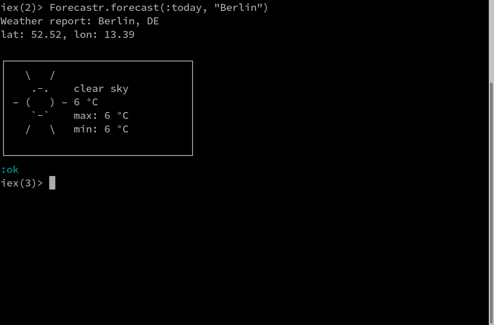
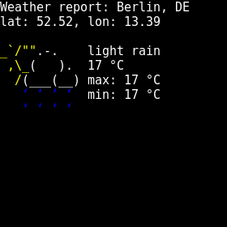
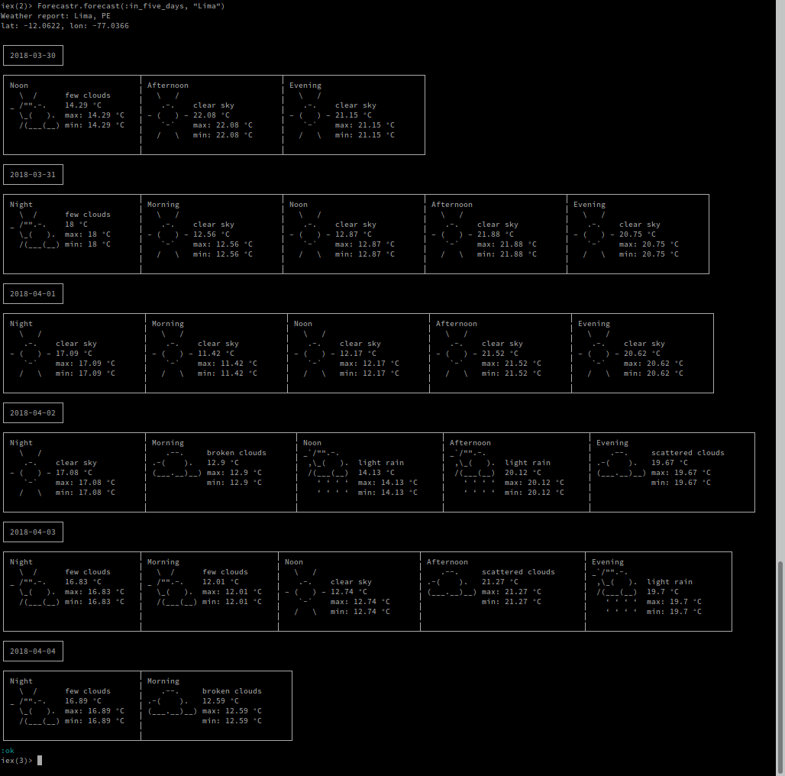

# Forecastr   


Forecastr is an open source Weather API wrapper for OpenWeatherMap and DarkSky API.

Forecastr is an Elixir flavour of http://wttr.in that talks directly to one of
the aforementioned weather services.
Aim of the project is to provide a website similar to wttr.in written entirely in elixir

**Project status: initial. (very alphaish)**

## Installation

The package can be installed by adding `forecastr` to your list of dependencies
in `mix.exs`:

```elixir
def deps do
  [
    {:forecastr, "~> 0.2"}
  ]
end
```

The documentation can be found at
[https://hexdocs.pm/forecastr](https://hexdocs.pm/forecastr).


**NOTE**
If you want to play with this project you have to obtain an api key from
http://openweathermap.org/ or https://darksky.net/ and:

```bash
export FORECASTR_API_KEY=YOUR_API_KEY
```

Also put in your `config/config.exs`

```elixir
config :forecastr,
  appid: System.get_env("FORECASTR_API_KEY"),
  backend: Forecastr.OWM,
  # 10 minutes by default
  ttl: 10 * 60_000
```

If you want to use the DarkSky API put `backend: Forecastr.Darksky`

Samples of output for today's forecast:

```elixir
Forecastr.forecast(:today, "lima")
```




Sample output with the OWM backend (the number of days is different depending on the backend used):

```elixir
Forecastr.forecast(:today, "lima")
```



> "*All the ducks are swimming in the water
> Fal de ral de ral do*" (Lemon Jelly cit.)


# TODO
- [X] Travis
- [X] JSON renderer
- [X] PNG Renderer with transparency (it's there but needs some love)
- [X] Integrate https://forecast.io (now DarkSky) as a backend?
- [ ] Tests! (some coverage, good enough for now ™, however if someone feels like to add more.. ;))
- [ ] Correct ASCII Art for the renderers that supports that (In progress)

# Thank yous

* The https://wttr.in project for inspiration
*  for the amazing ASCII art
